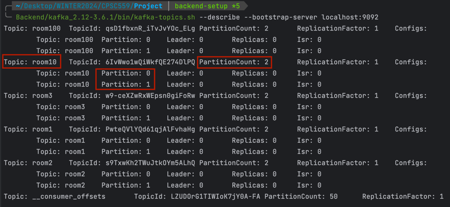

# Kafka Setup (Apple)

## Add Kafka binary files to your $PATH
Setup the `$PATH` environment variable
In order to easily access the Kafka binaries, you can edit your `PATH` variable by adding the following line (edit the content to your system) to your system run commands (for example `~/.zshrc` if you use zshrc):

To make it easier, run `pwd` on the `Backend` directory, copy the output and append `/kafka_2.12-3.6.1/bin` to it.

`export PATH="$PATH:/Users/PATH_TO_DIR/Smart-Thermostat-System/Backend/kafka_2.12-3.6.1/bin"`

This ensures that you can now run the kafka commands without prefixing them.

After reloading your terminal, the following should work from any directory `kafka-topics.sh`

Before starting, make sure you are on the `Backend` directory (`cd Backend`) 
and run the following commands to get started with Kafka

## Run the Zookeeper Server (a service to maintain the main kafka server)
`zookeeper-server-start.sh ./kafka_2.12-3.6.1/config/zookeeper.properties
`

## Start the Kafka server (main kafka server with the queue)
`kafka-server-start.sh ./kafka_2.12-3.6.1/config/server.properties
`

### Optional: Testing that Kafka works
Run the producer (which is basically a message intake to the queue)
``

# Kafka Setup (Windows)
1. Install Kafka [here](https://kafka.apache.org/downloads)
> [!NOTE]
> Download the 2.12 version

2. Extract the folder
> [!NOTE]
> I would recommend moving the folder to your C Drive and renaming it to just "kafka"

3. Start up zookeeper
Go into the kafka folder and open up the terminal
Start zookeeper by typing in this command
```
.\bin\windows\zookeeper-server-start.bat .\config\zookeeper.properties
```

4. Start the kafka server
Open up another terminal in the kafka folder
Start the server by typing in this command
```
.\bin\windows\kafka-server-start.bat .\config\server.properties
```

5. Run ThermostatBackendApplication in the backend folder of the project

# !!!IMPORTANT!!!  
## Kafka Config 
In order to create the topics with 2 partitions each, navigate to the `server.properties` file that is inside the `kafka_2.12-3.6.1/config`
and change the `num.partitions` to 2 from 1 (change to `num.partitions=2`). If this is not changed, it might introduce bugs as
the system depends on each topic to have 2 topics. To confirm that 2 partitions for each topic is created, type this command from the `Smart-Thermostat-System` directory:
`Backend/kafka_2.12-3.6.1/bin/kafka-topics.sh --describe --bootstrap-server localhost:9092`. It should have an output similar to this:


(Ignore all the `Topic: __consumer_offsets`)

> [!NOTE]
> If you are still getting 1 partition delete the folders kafka-logs
> For Mac: type in terminal: rm -rf ~/tmp/kafka-logs
> For Windows: go into C:\tmp\kafka-logs and delete the folder kafka-logs

# Running the backend
> [!CAUTION]
> If the Kafka server is randomly terminating, go to your tmp folder and delete the folder "kafka-logs"
1. Start up the zookeeper server first
2. Start up the Kafka server on a separate terminal
3. To start the thermostats run ThermostatBackendApplication under the Thermostats package
4. To start the proxy server run ProxyApplication under the Proxy package
5. To start any of the central servers run Replica#Application under the CentralServer/Replica# package (at least one of them has to be running)
   - For example: Replica1Application can be run under the CentralServer/Replica1 package
6. To start any of the database servers run DB_replica# under the CentralServer/Database# package (at least one of them has to be running)
   - For example: DB_replica1 can be run under the CentralServer/Database1 package
